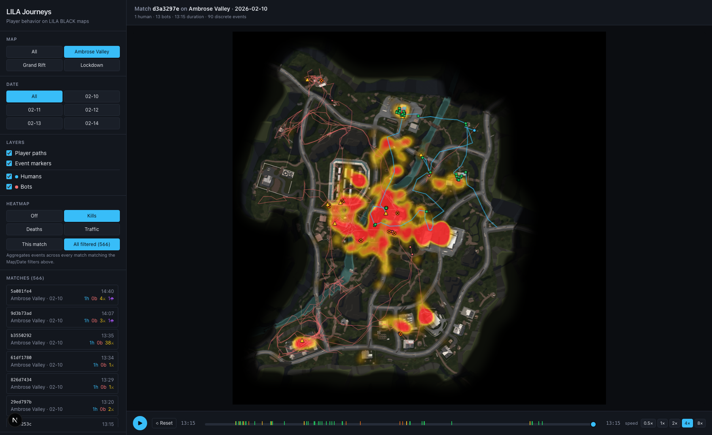
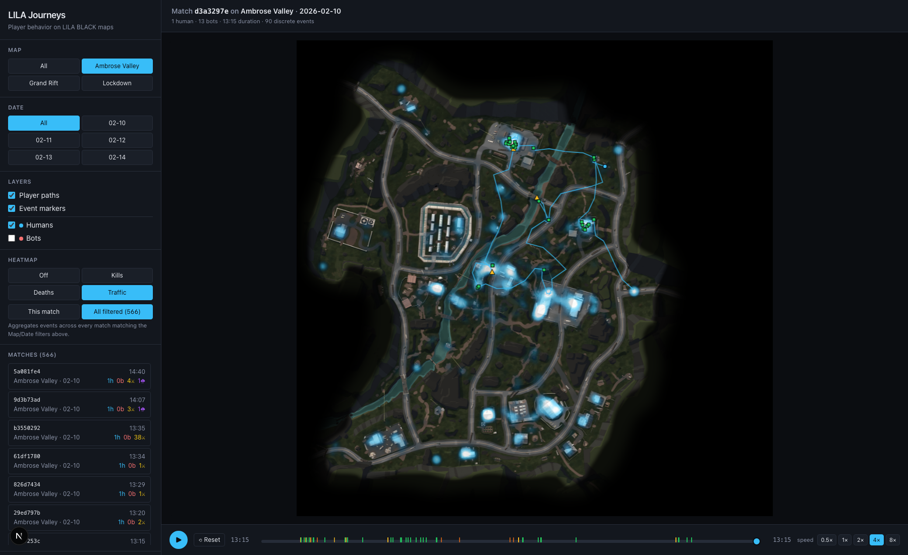
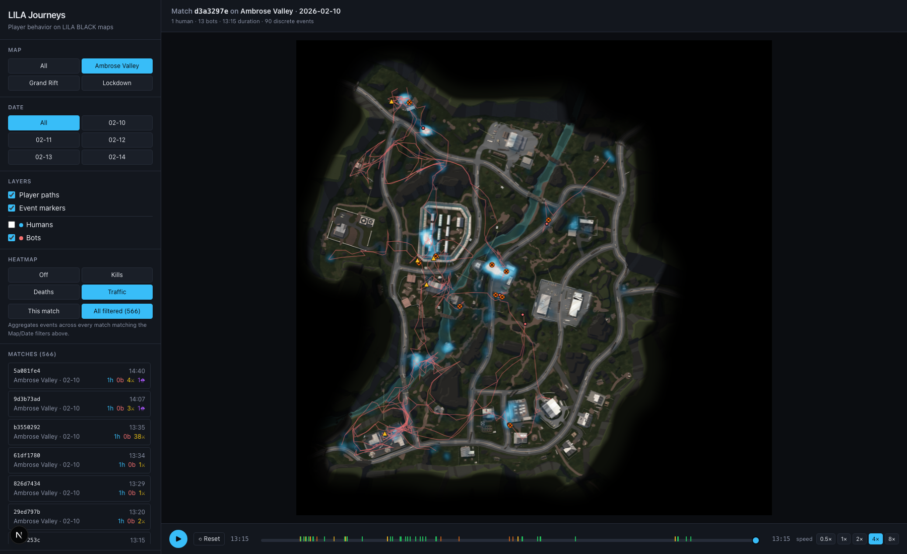
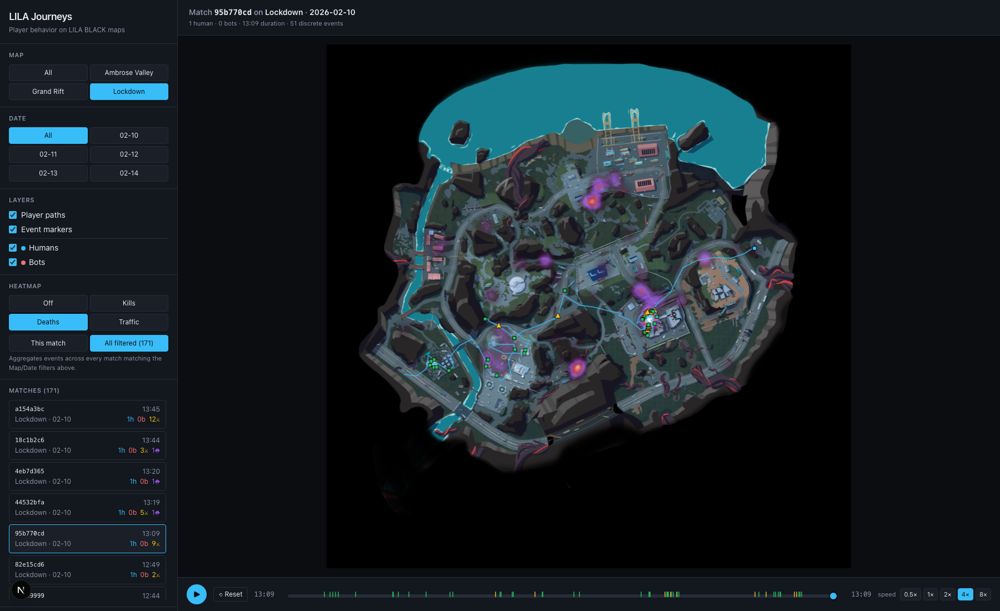

# INSIGHTS

Three things I learned about LILA BLACK using the tool I built. Every number
here comes from the shipped dataset (89,104 rows · 796 matches · Feb 10-14
2026) and is reproducible with the script at
[`scripts/preprocess.py`](scripts/preprocess.py) plus a quick aggregation pass.

---

## 1. Ambrose Valley has a "meatgrinder" in the center — 8% of the map area contains 55% of all kills

### What caught my eye

Turning on the **Kills heatmap · All filtered** view on Ambrose Valley, there's
a single blazing hot cluster in the center of the map. Not a gradient — a hard
island of red.

### The evidence

Binning Ambrose kills into a 10×10 UV grid:

| Top cell (UV) | World position | Kills |
|---|---|---|
| (0.55, 0.45) | ( 125, -68) | 224 |
| (0.35, 0.45) | ( -55, -68) | 208 |
| (0.45, 0.55) | (  35,  22) | 166 |
| (0.45, 0.45) | (  35, -68) | 162 |
| (0.35, 0.55) | ( -55,  22) | 141 |

Those 5 adjacent cells = **901 of 1,799 Ambrose kills (50%)**. A broader
center box (UV `[0.30–0.60] × [0.35–0.60]`, **8% of map area**) holds **55% of
all kills** — **7.3× the expected density** if kills were uniform.

It isn't just violence — that same center box also holds **33% of all loot
pickups** (`4.4× expected density`). Loot density → player density → kills.
Cause and effect are hard to disentangle from one week of data, but the
concentration is real.

### Actionable?

Yes, and the decisions are concrete:

- **If the honey-pot is intentional:** great, leave it — but instrument
  time-to-first-kill by spawn quadrant; that's the fairness signal that
  matters.
- **If players are being funneled without choosing to:** either **dilute the
  center's loot** (push some high-value crates outward toward 0.2 and 0.8 UV)
  or **add flanks** that bypass the center for extract.

**Metrics that would move if you tune this:**

- Kills-per-square-meter variance across 10×10 grid (goal: decrease)
- % of matches where a player never enters the center box (goal: increase)
- Median number of distinct POIs visited per player (goal: increase)
- Per-map TTK distribution tail (goal: flatten — fewer instant chain-kills in one cell)

### Why a Level Designer should care

If 55% of your fights happen on 8% of your map, you're not shipping a
battle-royale map — you're shipping an arena with some scenery around it.
Either own that, or redesign to put the rest of the map to work.

---

## 2. Bots are effectively stationary loot-props — they travel half as far and loot 65× less than humans

### What caught my eye

Flipping **Traffic · All filtered** between "Humans only" and "Bots only"
produces two radically different pictures on the same map. Humans bathe the
whole map in cyan; bots are a few faint puddles.

| Humans only | Bots only |
|---|---|
|  |  |

### The evidence

Across the full dataset (sampled over all maps):

| Metric | Humans | Bots | Ratio |
|---|---:|---:|---:|
| Player-match records | 781 | 461 | — |
| Events per player (any type) | 19.78 | 1.29 | **15×** |
| Kills per player | 2.86 | 0.40 | 7× |
| **Loot pickups per player** | **16.35** | **0.25** | **65×** |
| Median distance traveled (Ambrose, world units) | 1,358 | 673 | **2×** |

Bots effectively spawn, walk a little, and get farmed by humans. **46% of all
human events dataset-wide are Loot pickups** (12,770 of 27,595 combat+loot
events) — humans are *very* motivated to loot. Bots aren't.

### Actionable?

Two forks depending on design intent:

- **If bots are supposed to feel like NPCs / PvE threats:** they're failing
  silently. Invest in AI — patrol paths, loot interaction, retreat-and-flank
  behavior. Baseline: median bot distance traveled should approach human
  median on the same map.
- **If bots are cannon-fodder by design (for pacing / power-fantasy):** own it
  in the level design — build obvious "bot rooms" / turret lanes where their
  stationariness is a feature, not a bug.

Either way, right now bots are a hidden content-cost — every match spends
compute on bot position updates that generate no meaningful gameplay signal.

**Metrics that would move:**

- `bot_distance / human_distance` median ratio per map (goal: ↑)
- `bot_loot_events / match` (goal: non-zero)
- % of human kills that came from a bot (goal: ↑ — right now bots do
  0.40 kills/player)

### Why a Level Designer should care

If bots don't move, a Level Designer's map-wide AI behavior assumptions are
wrong. Paths you routed for AI traffic are empty. Cover you placed for AI
firefights is purely human↔human. Either fix the bots or redesign the map on
the assumption that bots are props, not participants.

---

## 3. The storm is 2.7× more lethal on Lockdown / Grand Rift than on Ambrose Valley — storm tuning isn't symmetric

### What caught my eye

Scanning the **Deaths heatmap** across the three maps, Lockdown and GrandRift
show bright magenta (storm) clusters, Ambrose barely shows any.

### The evidence

Across the 5-day dataset:

| Map | Total deaths | Storm deaths | Storm share |
|---|---:|---:|---:|
| Ambrose Valley | 505 | 17 | **3.4%** |
| Grand Rift | 52 | 5 | **9.6%** |
| Lockdown | 185 | 17 | **9.2%** |

Absolute counts on GrandRift are small, but the directional result holds on
Lockdown too with a larger sample. **On the smaller maps, the storm closes
~3× as aggressively in percentage terms.**

On Lockdown specifically, storm deaths cluster in the eastern-middle strip —
UV cells (5,4) and (6,4) hold 5 of 17 storm deaths (29%). Either the storm
sweeps through that corridor on most matches or the extract route there is
poorly positioned relative to the final circle.

### Actionable?

- **Option A (storm tuning):** If extraction time is scaled by map area, check
  that the math is right — on a smaller map, the storm-to-area ratio may be
  effectively faster even if absolute timers look identical.
- **Option B (extract routing):** Add or re-route extract points away from the
  Lockdown east-middle cluster; signal storm edges more clearly in that
  corridor.
- **Option C (just own it):** If you want these maps to feel more punishing, no
  change needed — but track the ratio because a patch that makes it *too*
  lethal will show up here first.

**Metrics that would move:**

- `storm_deaths / total_deaths` per map per patch (guardrail metric — alert
  on any drift above ~12%)
- Median time-to-extract by map
- % of matches with at least one storm death per map

### Why a Level Designer should care

Storm-vs-combat death share is the cleanest single number for "is this map
letting players finish what they started?" A map whose storm kills scale
disproportionately suggests extract geometry, spawn logic, or storm pacing
that doesn't translate from the flagship map to the smaller ones.
