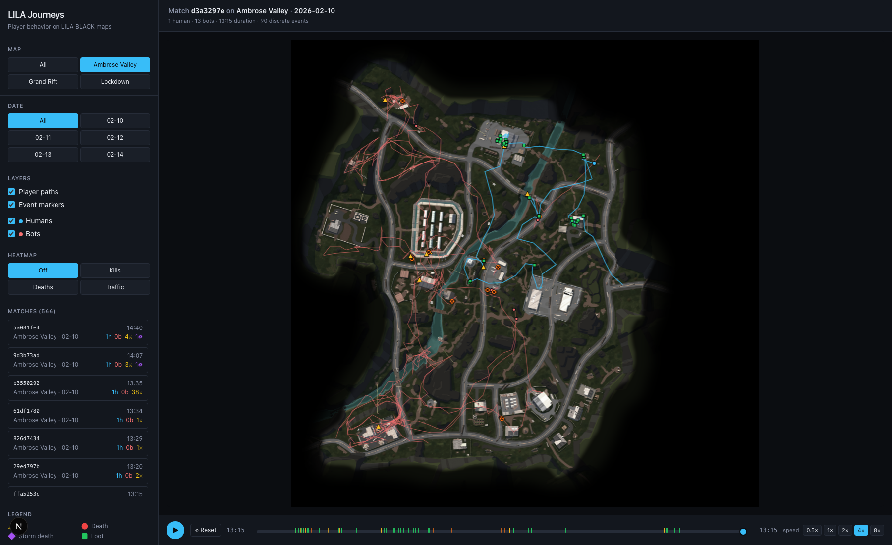

# LILA Journeys

A browser-based player journey visualization tool for **LILA BLACK** telemetry.
Built for Level Designers to see — on the actual minimap — where players move,
where fights break out, where loot is farmed, and where the storm kills people.

**Live deployment:** _(fill in after Vercel deploy — see `DEPLOY.md`)_



---

## What it does

- Load and parse 5 days of production parquet telemetry (~89k events, 796 matches, 339 unique players)
- Render per-match player paths on the correct minimap with a verified world→pixel transform
- Distinguish **humans** (cyan) from **bots** (red) with both path color and toggleable layers
- Plot discrete events as distinct markers:
  - ▲ **Kills** (yellow)
  - ● **Deaths** (red)
  - ◆ **Storm deaths** (purple)
  - ■ **Loot pickups** (green)
- Filter by **map**, **date**, and **match** in a sidebar; live-updates the canvas
- **Timeline playback** (0.5×–8×) to scrub through a match; event ticks on the bar
- **Heatmap overlays** for kills / deaths / traffic, with two scopes:
  - _This match_ — the currently selected match only
  - _All filtered_ — aggregates across every match passing the Map/Date filter (~80-match cap for perf)
- Heatmaps respect the humans/bots toggles so you can see, e.g., bot-only traffic
- Hosted as a static Next.js site — zero runtime backend

---

## Repo layout

```
lila/
├── scripts/
│   ├── preprocess.py      parquet → JSON ETL
│   └── sanity/            coordinate-mapping sanity renders (ignored in deploy)
├── web/                   Next.js 16 + React 19 app (Tailwind, Canvas 2D)
│   ├── app/               pages, layouts, globals
│   ├── components/        MapCanvas, FilterPanel, Timeline
│   ├── lib/               types, map configs, data loader
│   └── public/
│       ├── minimaps/      minimap PNG/JPG (copied from dataset)
│       └── data/          generated JSON — index.json + matches/<id>.json
├── docs/screenshots/      screenshots referenced in INSIGHTS.md / README
├── ARCHITECTURE.md        one-page design doc
├── INSIGHTS.md            three findings with evidence + Level-Designer actions
└── README.md              this file
```

---

## Tech stack

| Layer | Tool | Why |
|-------|------|-----|
| Data prep | Python 3 + pyarrow + pandas | Parquet is a first-class citizen; handles byte-decoded `event` column and the int64-as-Unix-seconds quirk cleanly |
| Output format | Per-match static JSON | 5 MB total gzipped — small enough to serve as static assets, no API server needed |
| Frontend | Next.js 16 + React 19 (App Router) | Zero-config Vercel deploy, TypeScript first-class, React Server Components not needed (this is fully client-rendered) |
| Styling | Tailwind CSS 3 | Fast iteration, no CSS sprawl |
| Rendering | HTML5 Canvas 2D | No library dependency; handles paths + markers + pixel-level heatmap in the same context |
| Deploy | Vercel static hosting | One-command deploy, free tier, auto-HTTPS |

No WebGL. No Konva. No Mapbox. The entire viz is ~350 lines of Canvas 2D in
[`web/components/MapCanvas.tsx`](web/components/MapCanvas.tsx).

---

## Running it locally

### Prerequisites

- **Python 3.10+** with `pyarrow` and `pandas` (for the ETL)
- **Node 18+** with npm
- The dataset at `~/Downloads/player_data/` or set `LILA_DATA_ROOT` env var

### One-time setup

```bash
# ETL (runs once — regenerate if source data changes)
python3 -m venv .venv
.venv/bin/pip install pyarrow pandas
.venv/bin/python scripts/preprocess.py
# → writes web/public/data/index.json + web/public/data/matches/<id>.json

# Web app
cd web
npm install
```

### Dev server

```bash
cd web
npm run dev
# → http://localhost:3000
```

### Production build

```bash
cd web
npm run build
npm start
```

### Environment variables

| Var | Default | Used by |
|-----|---------|---------|
| `LILA_DATA_ROOT` | `/Users/<you>/Downloads/player_data` | `scripts/preprocess.py` — where raw parquet lives |

No runtime env vars. The frontend reads only the static JSON it ships with.

---

## Deployment

See [`DEPLOY.md`](DEPLOY.md) for the one-command Vercel deploy. tl;dr:

```bash
cd web && npx vercel --prod
```

---

## The coordinate mapping — the part that's easy to get wrong

The dataset README gives a formula assuming 1024×1024 minimaps, but the actual
images range from 2160² to 9000². The transform still works — just treat the
1024 as arbitrary and use UV space:

```ts
u = (world_x - origin_x) / scale    // 0..1
v = (world_z - origin_z) / scale    // 0..1
pixel_x = u * rendered_width
pixel_y = (1 - v) * rendered_height // Y flipped: image origin is top-left
```

`y` in the data is world elevation — not used for 2D plots. See
[`ARCHITECTURE.md`](ARCHITECTURE.md) for the other dataset gotcha (the `ts`
column claims ms-elapsed but is really Unix seconds).

---

## Feature checklist (from the brief)

- [x] Load and parse the provided parquet data
- [x] Display player journeys on the correct minimap with correct coord mapping
- [x] Distinguish humans and bots visually (cyan vs red + layer toggles)
- [x] Show kills / deaths / loot / storm as distinct markers
- [x] Filter by map / date / match
- [x] Timeline playback (play/pause, 0.5×–8×, scrub + event ticks)
- [x] Heatmap overlays for kills / deaths / traffic, per-match and aggregated
- [x] Hosted at a shareable URL (see `DEPLOY.md`)
- [x] README / ARCHITECTURE.md / INSIGHTS.md

---

## Known gaps / things I'd do next

- **Multi-match comparison view** — side-by-side heatmaps of two date ranges to
  spot regressions after a patch.
- **POI drill-down** — click a hotspot and get the list of matches / players
  that contributed to it.
- **Smarter aggregate scope** — current 80-match cap on "All filtered" is a perf
  shortcut; a pre-computed server-side heatmap bin would scale further.
- **Extract points overlay** — the dataset doesn't include extract/storm-edge
  positions; if the engine emitted them, the storm-death analysis becomes
  much richer.
